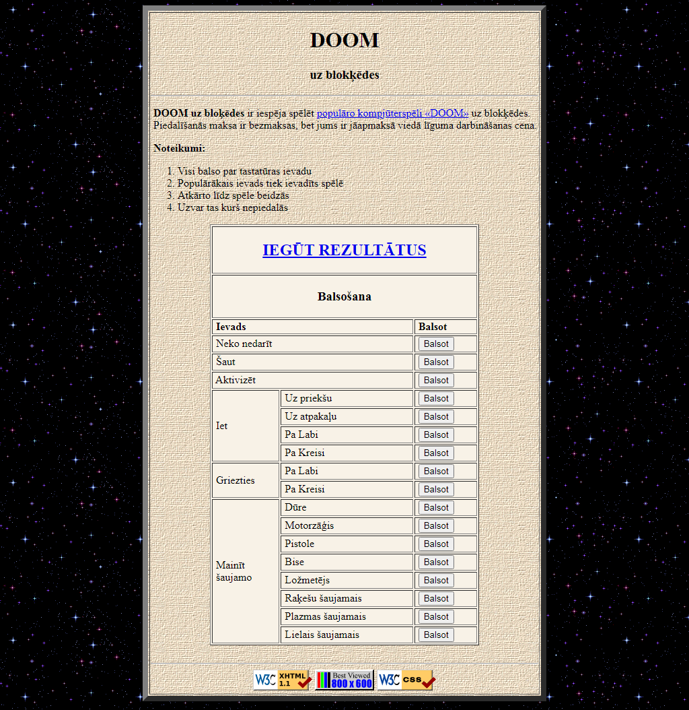

# Doom uz Blokķēdes

Kolektīvā Doom spēle uz blokķēdes.

#### Problēma
Neierobežots daudzums mērkaķu grib vienlaicīgi (uz viena datora) spēlēt Doom. Vienā telpā ir ļoti grūti iedabūt iekšā neierobežotu daudzumu mērkaķu, turklāt USB standards neļauj iespraust neierobežotu daudzumu tastatūru vienā datorā.

#### Risinājums
Mērkaķi veic tastatūras ievada balsojumu caur "Doom: uz blokķēdes" lietotni. Balsojumi tiek uzglabāti blokķēdē (tā spēj uzglabāt neierobežoti lielu daudzumu datu). Balsojumi pēc tam var tikt ievadīti Doom spēlē un mērkaķi var redzēt savus ievadus.

## Instruckija

Vajag lejupielādēt repozitoriju, kā arī pārbaudīt ka ir ieinstalēts blokķēdes emulators (Ganache, varbūt strādā arī citi), Truffle viedo līgumu izstādes vide, Node.js servera programmatūra.

### Aplikācijas darbināšana
1) Palaist blokķēdes emulatoru.
2) Iesāknēt termināli projekta saknes direktorijā.
3) Ievadīt komandu 'truffle migrate --reset'.
4) Ievadīt komandu 'cd majslapa'.
5) Atvērt failu 'index.js'.
6) Nomainīt mainīgo 'blockchain_emulator' uz bloķēdes emulatora adresi.
7) Nomainīt mainīgo 'doom_contract_address' uz doom līguma adresi.
8) Atvērt failu 'main_page.js'.
7) Nomainīt mainīgo 'doom_contract_address' uz doom līguma adresi.
0) Ievadīt komandu 'node index.js'.
1) Pārlūkprogrammā ievadīt adresi '127.0.0.1'.
2) ???
3) peļņa

### Orākula darbināšana
1) Iesāknēt termināli projekta saknes direktorijā.
2) Ievadīt konsolē 'truffle console'.
3) Ievadīt konsolē 'let doom = await Doom.deployed()'.
4) Ievadīt konsolē doom.UpdateState(x);
   x = 0, ja nekas nenotika;
   x = 1, ja līmenis izgājās;
   x = 2, ja līmenis neizgājās.
